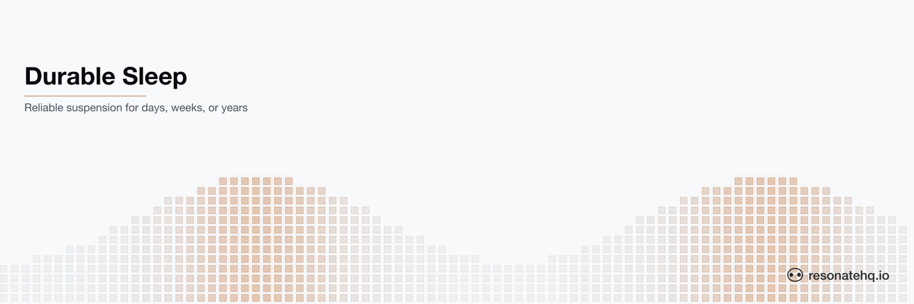

<picture>
  <source media="(prefers-color-scheme: dark)" srcset="./assets/banner-dark.png">
  <source media="(prefers-color-scheme: light)" srcset="./assets/banner-light.png">
  
</picture>

<p align="center">
  <a href="https://resonatehq.github.io/examples-ci/">
    
  </a>
</p>

# Durable Sleep

**Resonate Rust SDK**

This example showcases the sleep API that enables a function to reliably sleep for days, weeks, or even years if needed.

Instructions on [How to run this example](#how-to-run-the-example) are below. The full pattern is documented at [docs.resonatehq.io/get-started/examples/durable-sleep](https://docs.resonatehq.io/get-started/examples/durable-sleep).

## Problem

A business process may need to sleep for a period much longer than the typical lifetime of a process.

Since a process is more likely to crash the longer it is alive, and if a business process needs to suspend (or "sleep") for days, weeks, or even years, then developers are often forced to use cron jobs as a means to reawaken long-sleeping processes.

This leads to complexity that is hard to reason about, test, and rely on.

## Solution

Resonate enables developers to sleep directly in their workflows without leaving the process running idle, reducing implementation complexity while ensuring the business process can survive across process crashes.

```rust
#[resonate::function]
async fn sleeping_workflow(ctx: &Context, secs: u64) -> Result<String> {
    println!("Sleeping for {secs} seconds...");

    ctx.sleep(Duration::from_secs(secs)).await?;

    Ok(format!("Slept for {secs} seconds"))
}
```

`ctx.sleep(...)` creates a server-backed timer promise and suspends the workflow until that promise resolves. The suspension is durable — if the worker crashes mid-sleep, another worker resumes the workflow when the timer fires.

## How to run the example

This example uses [Cargo](https://www.rust-lang.org/tools/install) as the build tool. After cloning, change directory into the project root.

This example application requires that a Resonate Server is running locally.

```shell
brew install resonatehq/tap/resonate
resonate dev
```

If you don't have brew, try one of these other [installation options](https://docs.resonatehq.io/operate/server-installation).

You will need 2 terminals to run this example, one for the Worker and one for the Client. This does not include the terminal where you started the Resonate Server.

In _Terminal 1_, start the Worker:

```shell
cargo run --bin worker
```

In _Terminal 2_, run the Client:

```shell
cargo run --bin client
```

The worker will print `Sleeping for 5 seconds...`, suspend on the durable timer, and resume to print `Slept for 5 seconds` in the client terminal once the timer fires. Try killing the worker mid-sleep and starting it back up — the workflow recovers from the server-side timer promise and finishes.

## Learn more

- [Resonate Documentation](https://docs.resonatehq.io)
- [Durable Sleep Pattern](https://docs.resonatehq.io/get-started/examples/durable-sleep)
- [Rust SDK Guide](https://docs.resonatehq.io/develop/rust)
